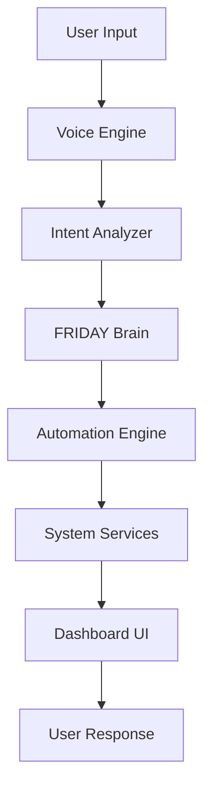

# FRIDAY AI Operating System

[](https://opensource.org/licenses/MIT)
[](https://www.python.org/)

---

## Project Overview

**FRIDAY** (Future‑Ready Intelligent Desktop Assistant) is an **AI Desktop Assistant**, **AI Operating System**, **Voice Assistant**, **Automation Platform**, **Developer Workspace**, and **Intelligent Dashboard** for Windows. It provides a unified, voice‑first interface that combines:

- **Conversational AI** – an AI Brain that processes intents, runs workflows, and maintains persistent memory.
- **Glass‑morphism Dashboard** – a cyber‑punk HUD with dynamic scaling, animated AI core, and responsive sidebars.
- **Voice Engine** – wake‑word detection, continuous speech capture, and high‑quality TTS (Edge‑TTS or ElevenLabs).
- **Automation Layer** – JSON‑defined workflows for launching apps, calling APIs, and chaining tasks.
- **Developer Workspace** – integrated terminal, command console, quick‑actions panel, and plugin system.

All components communicate via PyQt signal/slot mechanisms, ensuring clean separation and easy extensibility.

---

## Current Features

### Dashboard
- Responsive HUD with animated circular core (pulse/wave states).
- Glass‑morphism UI panels with neon‑cyan borders.
- Adaptive layout that scales with window size.
- Responsive sidebars (left profile/brain, right quick‑actions).
- Avatar redesign with cyan glow.

### Voice
- Wake‑word support (`hey friday`).
- Continuous speech capture with realtime level visualisation.
- Text‑to‑speech (pyttsx3, optional ElevenLabs).
- Voice command queue and mic‑level fix.

### AI
- Central **FRIDAY Brain** for intent routing and LLM orchestration (Ollama primary, Gemini fallback).
- Persistent SQLite memory with automatic categorisation.
- Declarative JSON workflow engine.
- Command processing and task planning.

### System Monitoring
- CPU / GPU temperature & utilization.
- RAM / VRAM usage.
- Disk I/O statistics.
- Network speed & IP information.
- System uptime.

### Developer
- Integrated terminal console.
- Application launcher & quick‑actions shortcuts.
- Command console for direct Brain interaction.
- Live log view with colour‑coded levels.

### Media
- Music player with playlist support.
- Weather widget (current + weekly forecast).
- Calendar overview.
- Simple note‑taking panel.

---

## Screenshots (placeholders)

*Dashboard* 

*Voice Mode* 

*Developer Mode* 

*Automation* 

*System Monitor* 

*Settings* 

---

## Folder Structure

```
FRIDAY/
├─ ai/                     # Core AI components (brain, intent analyzer, providers)
├─ automation/            # Workflow engine, app launcher, browser controller
├─ memory/                # SQLite wrapper, memory categorisation
├─ ui/                    # Qt UI (dashboard, widgets, HUD)
│   └─ widgets/           # Reusable custom widgets
├─ voice/                 # Voice capture, TTS worker, queue handling
├─ docs/                  # Documentation (this folder)
├─ assets/                # Images, icons, screenshots
├─ config.py              # Global configuration constants
├─ main.py                # Application entry point, wiring of components
├─ requirements.txt       # Python dependencies
├─ workflows.json         # Declarative workflow definitions
└─ README.md              # Project overview (this file)
```

---

## Architecture



The system is built on a **Qt‑based event‑driven core**. All modules interact via PyQt **signal/slot** connections, providing loose coupling and extensibility.

---

## Technologies Used

- Python 3.11 (compatible with 3.9‑3.11)
- PyQt5 – GUI framework
- NumPy – audio waveform generation
- SpeechRecognition – speech‑to‑text
- pyttsx3 / ElevenLabs – TTS engines
- psutil – system metrics
- requests – HTTP client
- python‑dotenv – environment variable loading
- SQLite – persistent memory
- Ollama (local LLM) & Gemini (cloud fallback)
- Planned: n8n integration for visual workflow orchestration

---

## Installation

1. **Clone the repository**
   ```bash
   git clone https://github.com/yourusername/FRIDAY.git
   cd FRIDAY
   ```
2. **Create a virtual environment**
   ```bash
   python -m venv .venv
   .venv\Scripts\activate   # Windows PowerShell
   ```
3. **Install dependencies**
   ```bash
   pip install -r requirements.txt
   ```
4. *(Optional)* Install Ollama and pull the model:
   ```bash
   ollama pull qwen2.5-coder:latest
   ```
5. **Configure environment variables**
   ```bash
   copy .env.example .env
   # Edit .env to add your API keys (GEMINI_API_KEY, ELEVENLABS_API_KEY, etc.)
   ```
6. **Run the application**
   ```bash
   python main.py
   ```

### Troubleshooting
- Ensure `ffmpeg` is installed for audio processing.
- Verify the microphone is enabled and not muted.
- If Ollama is unavailable, the system falls back to Gemini (requires API key).

---

## Environment Variables

| Variable | Description | Required | Default |
|----------|-------------|----------|---------|
| `GEMINI_API_KEY` | Gemini cloud API key for fallback LLM | No | – |
| `ELEVENLABS_API_KEY` | ElevenLabs TTS API key for high‑quality voice output | No (Edge‑TTS fallback) | – |
| `WAKE_WORD` | Phrase to activate voice listening (e.g., `hey friday`) | Yes | `hey friday` |
| `LOG_LEVEL` | Logging verbosity (`INFO`, `DEBUG`, etc.) | No | `INFO` |
| `DB_PATH` | Path to SQLite memory database | No | `memory/friday_memory.db` |

---

## Roadmap

### Completed (v1.0 – Stable)
- Core AI brain, memory, workflow engine, voice pipeline, dashboard UI.

### In Progress (v1.1)
- Responsive dashboard redesign (HUD scaling, sidebar redesign, avatar glow).
- Voice system refinements (mic level fix, ElevenLabs integration).
- AI Brain panel UI overhaul and active‑applications redesign.

### Planned
- Enhanced personality (Chief‑style responses, tone tuning).
- Advanced memory grounding and semantic search.
- Additional HUD micro‑animations and colour states.

### Future Vision (v2.0)
- Multi‑agent architecture, robotics control, scheduling system, semantic knowledge graph, plugin marketplace.

---

## Known Limitations
- Windows‑only (uses Windows shortcuts for app launching).
- No offline speech‑to‑text; relies on external STT services.
- Limited intent set – only explicitly defined commands are recognised.
- No multi‑language support.
- Workflow engine supports linear steps only; no branching.
- No built‑in plugin marketplace yet.

---

## Contributing

We welcome contributions! Please see [docs/Contributing.md](docs/Contributing.md) for guidelines on pull requests, coding standards, and testing.

---

## License

MIT License – see `LICENSE` for details.

---

## Author

**Deepak Rajan Morje** – Creator and maintainer.
